# MQTT 协议完全指南：物联网开发者必读

> 这是一篇关于 MQTT 协议的超详细指南，涵盖协议原理、交互流程、数据包结构、部署架构和实战代码。建议收藏慢慢读！

---

## 目录

1. [什么是 MQTT？](#1-什么是-mqtt)
2. [MQTT 的核心概念](#2-mqtt的核心概念)
3. [MQTT Broker 深度解析](#3-mqtt-broker深度解析)
4. [协议交互全流程图解](#4-协议交互全流程图解)
5. [数据包结构详解](#5-数据包结构详解)
6. [三大部署架构对比](#6-三大部署架构对比)
7. [底层传输协议揭秘](#7-底层传输协议揭秘)
8. [Python 实战代码](#8-python实战代码)
9. [Go 实战代码](#9-go实战代码)
10. [常见应用场景](#10-常见应用场景)

---

## 1. 什么是 MQTT？

MQTT（Message Queuing Telemetry Transport）是一种**基于发布/订阅模式的轻量级消息传输协议**，专为低带宽、高延迟或不可靠的网络环境设计。

它由 IBM 的 Andy Stanford-Clark 和 Eurotech 的 Arlen Nipper 于 1999 年发明，最初用于监控石油管道。2013 年成为 OASIS 开放标准，2019 年成为 ISO 国际标准（ISO/IEC 20922）。

### 1.1 为什么选择 MQTT？

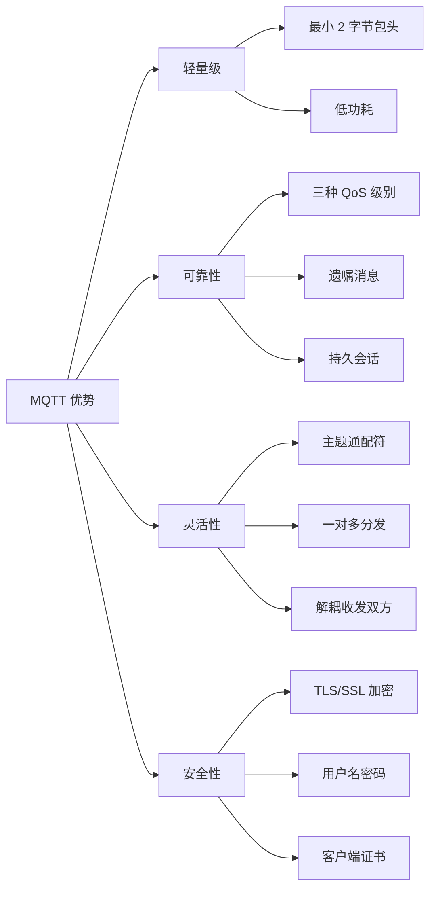
```mermaid
graph LR
    A[MQTT 优势] --> B[轻量级]
    A --> C[可靠性]
    A --> D[灵活性]
    A --> E[安全性]
    
    B --> B1[最小 2 字节包头]
    B --> B2[低功耗]
    
    C --> C1[三种 QoS 级别]
    C --> C2[遗嘱消息]
    C --> C3[持久会话]
    
    D --> D1[主题通配符]
    D --> D2[一对多分发]
    D --> D3[解耦收发双方]
    
    E --> E1[TLS/SSL 加密]
    E --> E2[用户名密码]
    E --> E3[客户端证书]
```

### 1.2 与其他协议对比

| 特性 | MQTT | HTTP | CoAP |
|------|------|------|------|
| 通信模式 | 发布/订阅 | 请求/响应 | 请求/响应 |
| 连接方式 | 长连接 | 短连接 | 短连接 |
| 传输协议 | TCP | TCP | UDP |
| 消息开销 | 2 字节起 | 数百字节 | 4 字节起 |
| QoS 支持 | 3 级 | 无 | 2 级 |
| 双向通信 | 原生支持 | 需轮询 | 需观察 |
| 适用场景 | IoT 实时消息 | Web API | 受限设备 |

---

## 2. MQTT 的核心概念

### 2.1 发布/订阅模式

传统 HTTP 是**请求/响应**模式，客户端必须主动请求才能获取数据。而 MQTT 采用**发布/订阅**模式，实现了消息生产者和消费者的完全解耦。

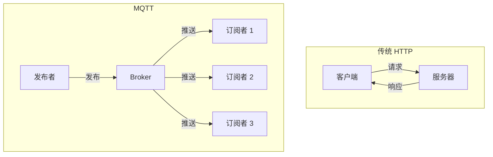
```mermaid
graph TB
    subgraph 传统 HTTP
        C1[客户端] -->|请求 | S1[服务器]
        S1 -->|响应 | C1
    end
    
    subgraph MQTT
        Pub[发布者] -->|发布 | Broker
        Broker -->|推送 | Sub1[订阅者 1]
        Broker -->|推送 | Sub2[订阅者 2]
        Broker -->|推送 | Sub3[订阅者 3]
    end
```

### 2.2 主题（Topic）

主题是 MQTT 消息路由的核心机制，采用**层级结构**，用斜杠 `/` 分隔：

```
home/living-room/temperature
factory/line-1/sensor/pressure
device/001/status
city/beijing/district/haidian
```

#### 通配符订阅

| 通配符 | 说明 | 示例 | 匹配结果 |
|--------|------|------|----------|
| `+` | 单层通配符 | `home/+/temperature` | `home/living-room/temperature`<br>`home/bedroom/temperature` |
| `#` | 多层通配符 | `home/#` | `home/living-room/temperature`<br>`home/living-room/humidity`<br>`home/bedroom/temperature` |

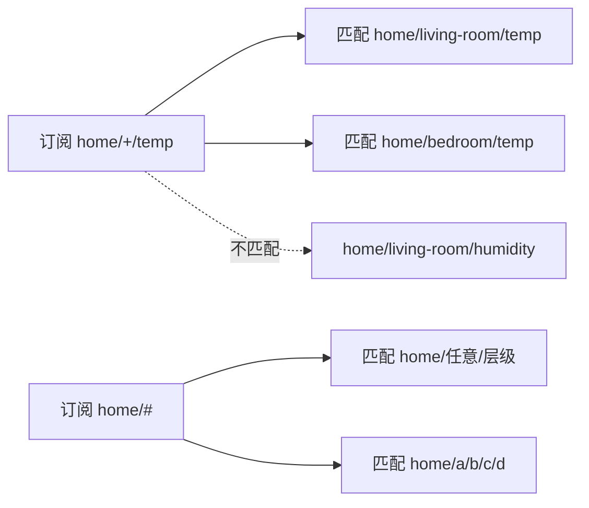
```mermaid
graph LR
    A[订阅 home/+/temp] --> B[匹配 home/living-room/temp]
    A --> C[匹配 home/bedroom/temp]
    A -.不匹配.-> D[home/living-room/humidity]
    
    E[订阅 home/#] --> F[匹配 home/任意/层级]
    E --> G[匹配 home/a/b/c/d]
```

### 2.3 服务质量（QoS）

MQTT 提供三种 QoS 级别，满足不同场景的可靠性需求：

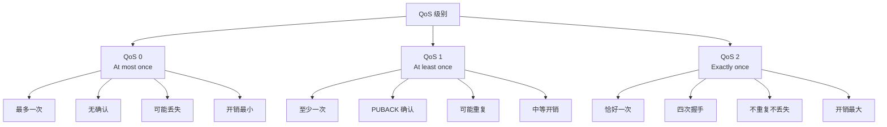
```mermaid
graph TB
    A[QoS 级别] --> B[QoS 0<br/>At most once]
    A --> C[QoS 1<br/>At least once]
    A --> D[QoS 2<br/>Exactly once]
    
    B --> B1[最多一次]
    B --> B2[无确认]
    B --> B3[可能丢失]
    B --> B4[开销最小]
    
    C --> C1[至少一次]
    C --> C2[PUBACK 确认]
    C --> C3[可能重复]
    C --> C4[中等开销]
    
    D --> D1[恰好一次]
    D --> D2[四次握手]
    D --> D3[不重复不丢失]
    D --> D4[开销最大]
```

#### QoS 对比表

| 特性 | QoS 0 | QoS 1 | QoS 2 |
|------|-------|-------|-------|
| 传递保证 | 最多一次 | 至少一次 | 恰好一次 |
| 确认机制 | 无 | PUBACK | PUBREC+PUBREL+PUBCOMP |
| 消息重复 | 可能丢失 | 可能重复 | 不重复 |
| 网络开销 | 1 个报文 | 2 个报文 | 4 个报文 |
| 适用场景 | 传感器数据 | 重要事件 | 计费/订单 |

---

## 3. MQTT Broker 深度解析

### 3.1 Broker 的核心功能

Broker 是 MQTT 架构的**心脏**，负责所有消息的路由和分发：

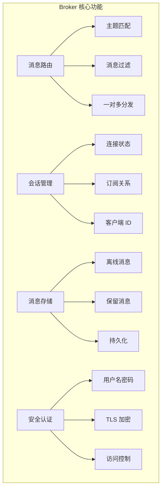
```mermaid
graph TB
    subgraph Broker 核心功能
        A[消息路由] --> A1[主题匹配]
        A --> A2[消息过滤]
        A --> A3[一对多分发]
        
        B[会话管理] --> B1[连接状态]
        B --> B2[订阅关系]
        B --> B3[客户端 ID]
        
        C[消息存储] --> C1[离线消息]
        C --> C2[保留消息]
        C --> C3[持久化]
        
        D[安全认证] --> D1[用户名密码]
        D --> D2[TLS 加密]
        D --> D3[访问控制]
    end
```

### 3.2 常见 Broker 实现

| Broker | 语言 | 特点 | 适用场景 |
|--------|------|------|----------|
| **Eclipse Mosquitto** | C | 轻量级、低功耗、Eclipse 基金会项目 | 嵌入式设备、边缘计算 |
| **EMQX** | Erlang | 高并发、分布式、支持百万连接 | 大规模 IoT 平台 |
| **HiveMQ** | Java | 企业级、可扩展、支持集群 | 企业应用 |
| **VerneMQ** | Erlang | 分布式、高可用、开源 | 云原生应用 |
| **RabbitMQ** | Erlang | 多协议支持、成熟稳定 | 通用消息队列 |
| **NanoMQ** | C | 超轻量、边缘计算优化 | 边缘网关 |

### 3.3 快速开始：使用 Mosquitto

```bash
# 安装 Mosquitto (macOS)
brew install mosquitto

# 安装 Mosquitto (Ubuntu/Debian)
sudo apt-get install mosquitto mosquitto-clients

# 启动 Broker
mosquitto -c /etc/mosquitto/mosquitto.conf

# 测试：终端 1 - 订阅
mosquitto_sub -h localhost -t "test/topic" -v

# 测试：终端 2 - 发布
mosquitto_pub -h localhost -t "test/topic" -m "Hello MQTT"
```

#### mosquitto.conf 配置示例

```ini
# 监听端口
listener 1883

# 匿名访问（生产环境建议关闭）
allow_anonymous false

# 密码文件
password_file /etc/mosquitto/passwd

# TLS 加密
listener 8883
cafile /etc/mosquitto/ca.crt
certfile /etc/mosquitto/server.crt
keyfile /etc/mosquitto/server.key

# 持久化
persistence true
persistence_location /var/lib/mosquitto/

# 日志
log_dest file /var/log/mosquitto/mosquitto.log
log_type error
log_type warning
```

---

## 4. 协议交互全流程图解

### 4.1 连接建立流程

客户端与 Broker 建立连接需要经历以下过程：

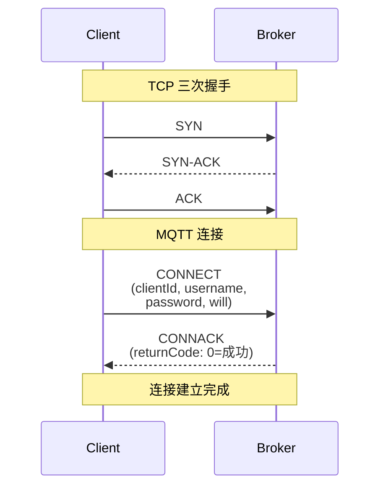
```mermaid
sequenceDiagram
    participant C as Client
    participant B as Broker
    
    Note over C,B: TCP 三次握手
    C->>B: SYN
    B-->>C: SYN-ACK
    C->>B: ACK
    
    Note over C,B: MQTT 连接
    C->>B: CONNECT<br/>(clientId, username,<br/>password, will)
    B-->>C: CONNACK<br/>(returnCode: 0=成功)
    
    Note over C,B: 连接建立完成
```

#### CONNECT 报文结构

```
Packet Type: 0001 (CONNECT)
Flags: 0000
Remaining Length: variable

Payload:
  - Protocol Name: "MQTT"
  - Protocol Level: 4 (MQTT 3.1.1) or 5 (MQTT 5.0)
  - Connect Flags:
    * Clean Session: 1
    * Will Flag: 0
    * Will QoS: 00
    * Will Retain: 0
    * Password Flag: 1
    * Username Flag: 1
  - Keep Alive: 60 秒
  - Client ID: "my-client-001"
  - Username: "user123"
  - Password: "pass456"
```

### 4.2 QoS 0 发布流程

最简单的发布流程，**无确认机制**：

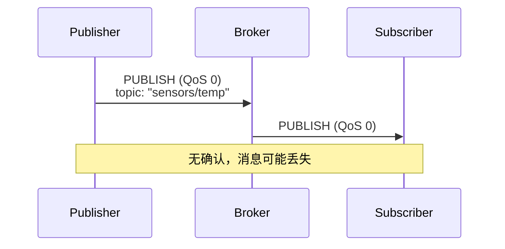
```mermaid
sequenceDiagram
    participant Pub as Publisher
    participant B as Broker
    participant Sub as Subscriber
    
    Pub->>B: PUBLISH (QoS 0)<br/>topic: "sensors/temp"
    B->>Sub: PUBLISH (QoS 0)
    Note over Pub,Sub: 无确认，消息可能丢失
```

**QoS 0 特点：**
- ✅ 最多一次：消息最多传递一次，不保证送达
- ✅ 无确认机制：发送后不等待任何响应
- ✅ 最低开销：只有一个 PUBLISH 报文
- ⚠️ 适用场景：传感器数据频繁上报，允许少量丢失

### 4.3 QoS 1 发布流程（至少一次）

需要**PUBACK 确认**，保证消息至少送达一次：

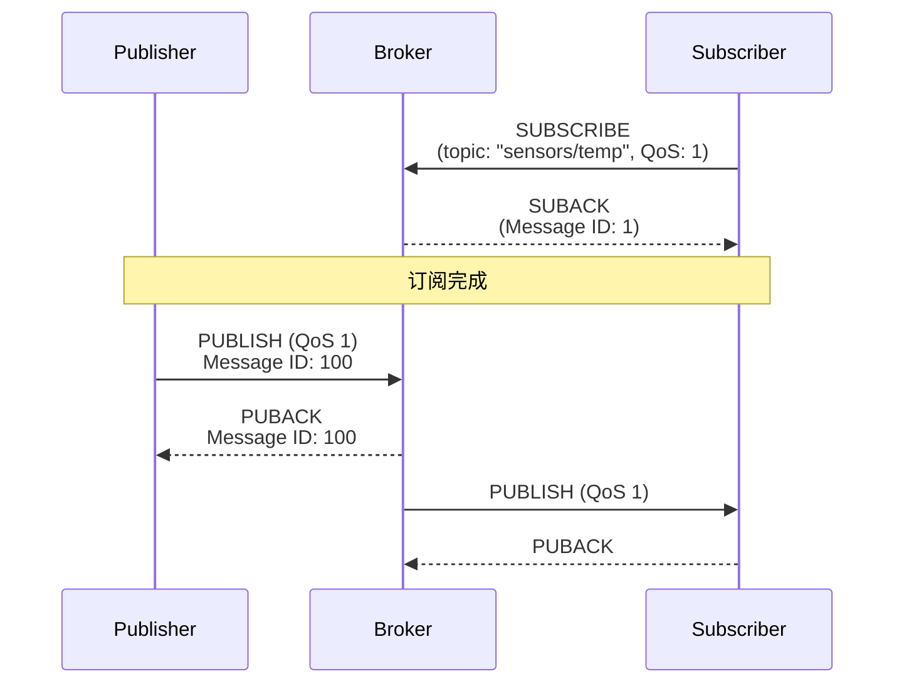
```mermaid
sequenceDiagram
    participant Pub as Publisher
    participant B as Broker
    participant Sub as Subscriber
    
    Sub->>B: SUBSCRIBE<br/>(topic: "sensors/temp", QoS: 1)
    B-->>Sub: SUBACK<br/>(Message ID: 1)
    
    Note over Pub,Sub: 订阅完成
    
    Pub->>B: PUBLISH (QoS 1)<br/>Message ID: 100
    B-->>Pub: PUBACK<br/>Message ID: 100
    
    B->>Sub: PUBLISH (QoS 1)
    Sub-->>B: PUBACK
```

### 4.4 QoS 2 完整握手流程（恰好一次）

最可靠的传输，需要**四次握手**：

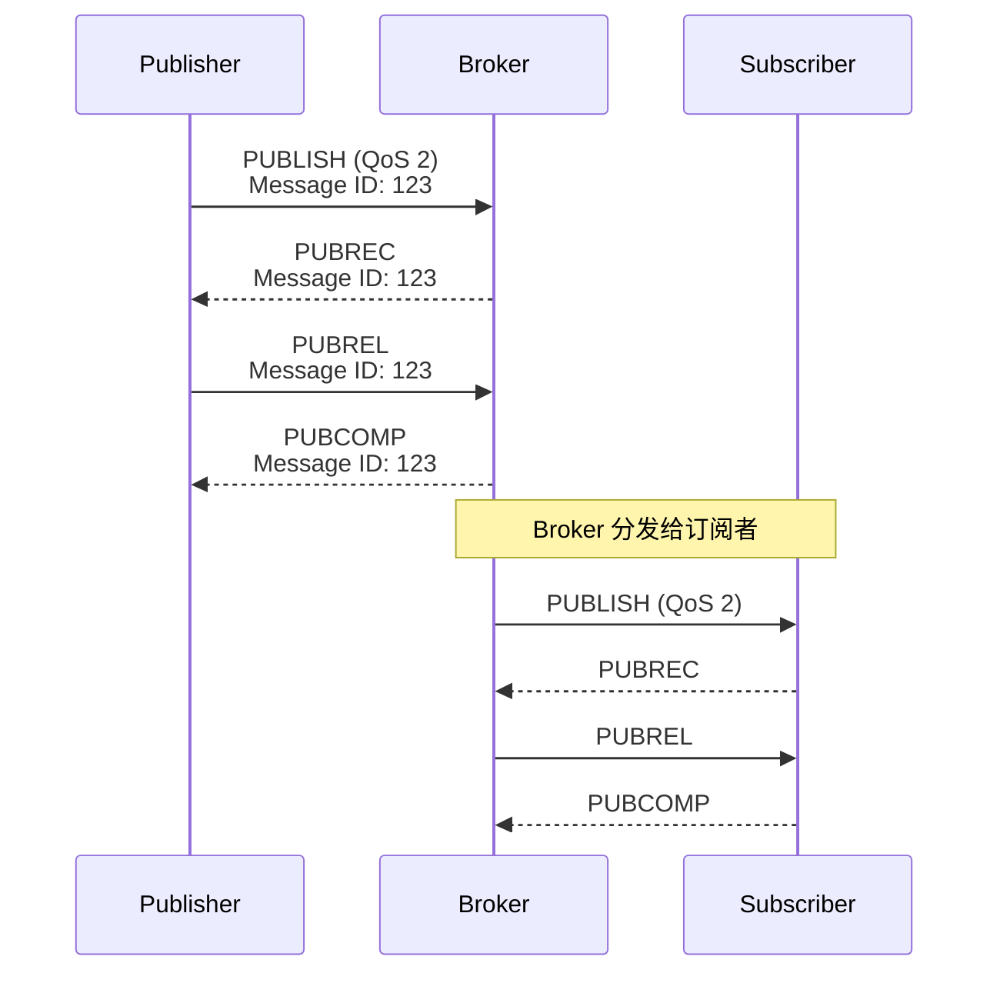
```mermaid
sequenceDiagram
    participant Pub as Publisher
    participant B as Broker
    participant Sub as Subscriber
    
    Pub->>B: PUBLISH (QoS 2)<br/>Message ID: 123
    B-->>Pub: PUBREC<br/>Message ID: 123
    Pub->>B: PUBREL<br/>Message ID: 123
    B-->>Pub: PUBCOMP<br/>Message ID: 123
    
    Note over B,Sub: Broker 分发给订阅者
    B->>Sub: PUBLISH (QoS 2)
    Sub-->>B: PUBREC
    B->>Sub: PUBREL
    Sub-->>B: PUBCOMP
```

#### QoS 2 四次握手说明

1. **PUBLISH**: 发布者发送消息
2. **PUBREC**: Broker 确认收到（Publish Received）
3. **PUBREL**: 发布者释放消息（Publish Release）
4. **PUBCOMP**: Broker 确认完成（Publish Complete）

### 4.5 遗嘱消息（Last Will）

遗嘱消息用于检测客户端**异常断开**：

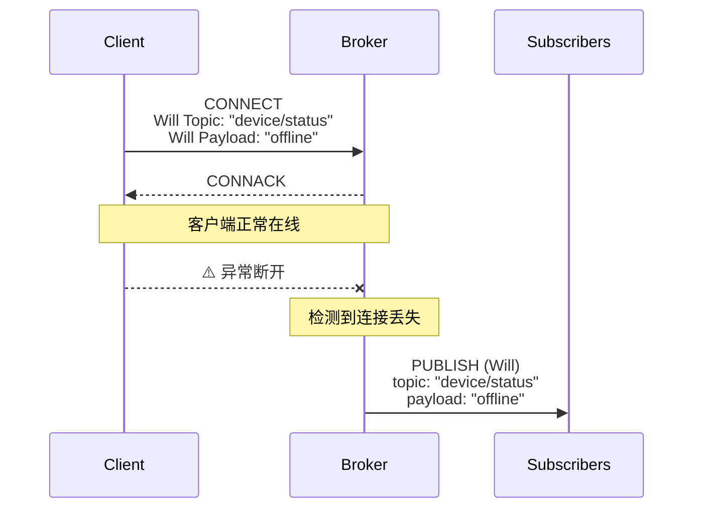
```mermaid
sequenceDiagram
    participant C as Client
    participant B as Broker
    participant S as Subscribers
    
    C->>B: CONNECT<br/>Will Topic: "device/status"<br/>Will Payload: "offline"
    B-->>C: CONNACK
    
    Note over C,B: 客户端正常在线
    
    C--xB: ⚠️ 异常断开
    Note over B: 检测到连接丢失
    B->>S: PUBLISH (Will)<br/>topic: "device/status"<br/>payload: "offline"
```

### 4.6 心跳保活机制

保持长连接，检测网络状态：

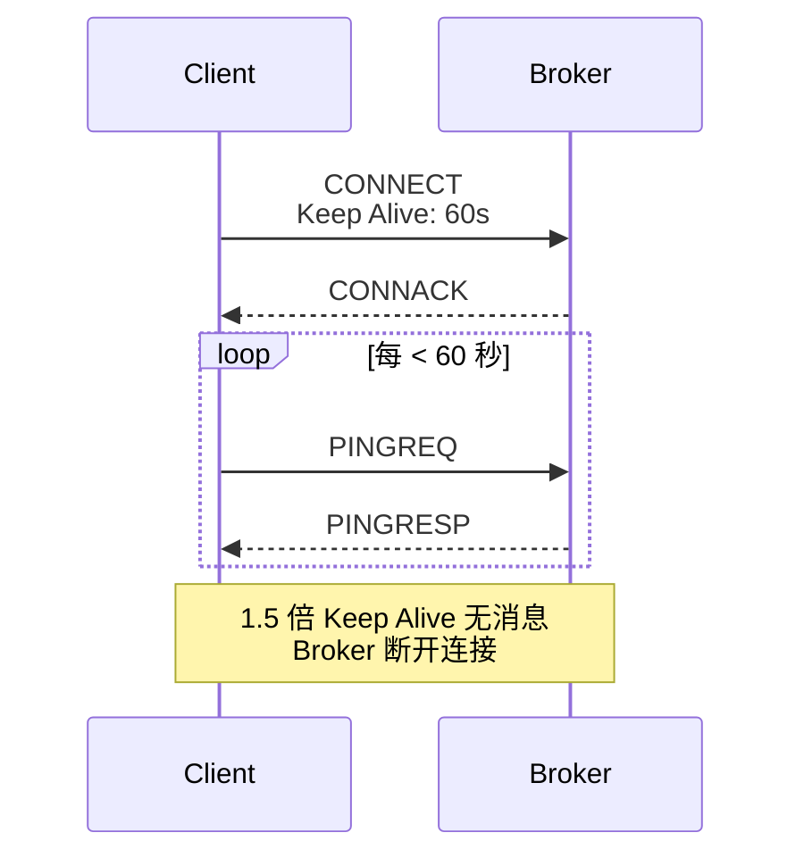
```mermaid
sequenceDiagram
    participant C as Client
    participant B as Broker
    
    C->>B: CONNECT<br/>Keep Alive: 60s
    B-->>C: CONNACK
    
    loop 每 < 60 秒
        C->>B: PINGREQ
        B-->>C: PINGRESP
    end
    
    Note over C,B: 1.5 倍 Keep Alive 无消息<br/>Broker 断开连接
```

### 4.7 完整会话流程

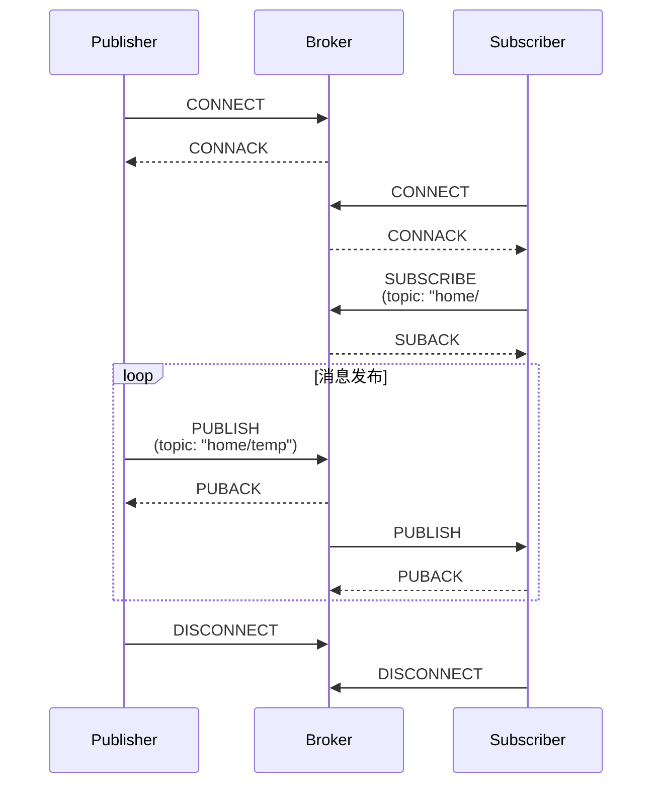
```mermaid
sequenceDiagram
    participant Pub as Publisher
    participant B as Broker
    participant Sub as Subscriber
    
    Pub->>B: CONNECT
    B-->>Pub: CONNACK
    
    Sub->>B: CONNECT
    B-->>Sub: CONNACK
    
    Sub->>B: SUBSCRIBE<br/>(topic: "home/#")
    B-->>Sub: SUBACK
    
    loop 消息发布
        Pub->>B: PUBLISH<br/>(topic: "home/temp")
        B-->>Pub: PUBACK
        B->>Sub: PUBLISH
        Sub-->>B: PUBACK
    end
    
    Pub->>B: DISCONNECT
    Sub->>B: DISCONNECT
```

---

## 5. 数据包结构详解

### 5.1 固定报头结构

每个 MQTT 数据包都由固定报头开始：

```
┌─────────────────┬─────────────────┬─────────────────────────┐
│  Byte 1         │  Byte 2+        │  Variable Header +      │
│  Packet Type    │  Remaining      │  Payload                │
│  (4 bits)       │  Length         │                         │
│  Flags (4 bits) │  (1-4 bytes)    │                         │
└─────────────────┴─────────────────┴─────────────────────────┘
```

### 5.2 报文类型

| 类型 | 值 | 说明 |
|------|-----|------|
| CONNECT | 1 | 客户端请求连接 |
| CONNACK | 2 | 连接确认 |
| PUBLISH | 3 | 发布消息 |
| PUBACK | 4 | QoS 1 确认 |
| PUBREC | 5 | QoS 2 收到（第一步） |
| PUBREL | 6 | QoS 2 释放（第二步） |
| PUBCOMP | 7 | QoS 2 完成（第三步） |
| SUBSCRIBE | 8 | 订阅请求 |
| SUBACK | 9 | 订阅确认 |
| UNSUBSCRIBE | 10 | 取消订阅 |
| UNSUBACK | 11 | 取消订阅确认 |
| PINGREQ | 12 | 心跳请求 |
| PINGRESP | 13 | 心跳响应 |
| DISCONNECT | 14 | 断开连接 |

### 5.3 PUBLISH 报文结构

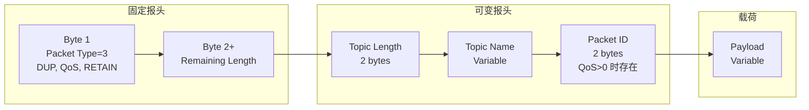
```mermaid
graph LR
    subgraph 固定报头
        A[Byte 1<br/>Packet Type=3<br/>DUP, QoS, RETAIN]
        B[Byte 2+<br/>Remaining Length]
    end
    
    subgraph 可变报头
        C[Topic Length<br/>2 bytes]
        D[Topic Name<br/>Variable]
        E[Packet ID<br/>2 bytes<br/>QoS>0 时存在]
    end
    
    subgraph 载荷
        F[Payload<br/>Variable]
    end
    
    A --> B --> C --> D --> E --> F
```

### 5.4 Byte 1 标志位详解

```
┌─────────────────────────────────────────────────────────┐
│  7  │  6  │  5  │  4  │  3  │  2  │  1  │  0  │
├─────┼─────┼─────┼─────┼─────┼─────┼─────┼─────┤
│  0  │  0  │  1  │  1  │ DUP │ QoS │ QoS │RETAIN│
│     Packet Type = 3 (PUBLISH)      │     Flags         │
└─────────────────────────────────────────────────────────┘
```

- **Bit 7-4**: Packet Type（PUBLISH = 0011）
- **Bit 3**: DUP 标志（是否重复消息）
- **Bit 2-1**: QoS 级别（00=QoS0, 01=QoS1, 10=QoS2）
- **Bit 0**: RETAIN 标志（是否保留消息）

### 5.5 剩余长度编码

MQTT 使用**可变长度编码**表示剩余长度：

| 值范围 | 字节数 | 示例 |
|--------|--------|------|
| 0 - 127 | 1 | `0x00 - 0x7F` |
| 128 - 16,383 | 2 | `0x80 0x01` = 128 |
| 16,384 - 2,097,151 | 3 | `0x80 0x80 0x01` = 16384 |
| 2,097,152 - 268,435,455 | 4 | `0x80 0x80 0x80 0x01` |

**编码规则：**
- 每个字节的最高位（bit 7）是延续位：1 表示还有后续字节，0 表示最后一个字节
- 低 7 位（bit 0-6）存储数据
- 采用小端序（Little Endian）

### 5.6 构建示例：发送温度数据

```python
# 字节流构建过程

# Byte 1: Packet Type (3) + Flags (QoS=1, DUP=0, Retain=0)
# 0011 0010 = 0x32
byte1 = 0x32

# Topic: "sensors/temperature" (20 字节)
topic = b'sensors/temperature'
topic_length = len(topic)  # 20 = 0x0014

# Packet Identifier (QoS 1 需要)
packet_id = 100  # 0x0064

# Payload
payload = b'{"temp": 25.5, "unit": "C"}'

# 计算 Remaining Length
# 2 (topic length) + 20 (topic) + 2 (packet id) + 26 (payload) = 50
remaining_length = 50  # 0x32

# 完整报文
packet = bytes([0x32, 0x32])  # Fixed header
packet += (topic_length).to_bytes(2, 'big')  # Topic length
packet += topic  # Topic
packet += (packet_id).to_bytes(2, 'big')  # Packet ID
packet += payload  # Payload

# 十六进制输出
print(packet.hex())
# 输出：3232001473656e736f72732f74656d706572617475726500647b2274656d70223a2032352e352c2022756e6974223a202243227d
```

---

## 6. 三大部署架构对比

### 6.1 云端部署（Cloud）

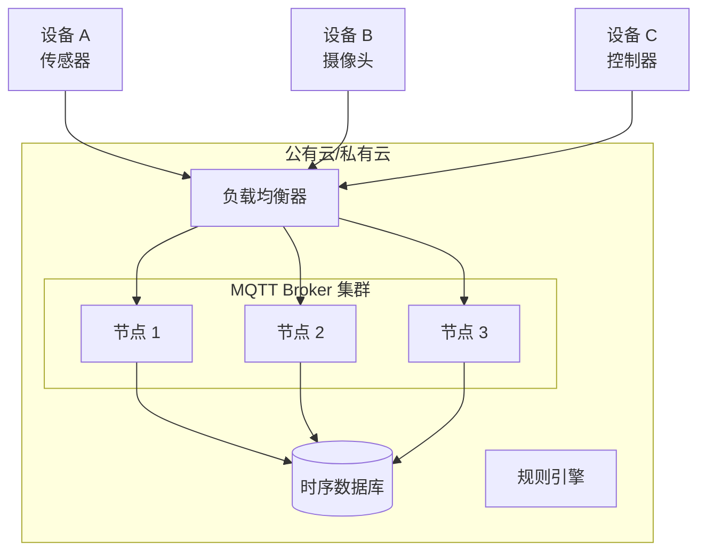
```mermaid
graph TB
    subgraph Cloud["公有云/私有云"]
        LB["负载均衡器"]
        subgraph Cluster["MQTT Broker 集群"]
            N1["节点 1"]
            N2["节点 2"]
            N3["节点 3"]
        end
        DB[("时序数据库")]
        RULE["规则引擎"]
    end
    
    LB --> N1
    LB --> N2
    LB --> N3
    N1 --> DB
    N2 --> DB
    N3 --> DB
    
    DeviceA["设备 A<br/>传感器"] --> LB
    DeviceB["设备 B<br/>摄像头"] --> LB
    DeviceC["设备 C<br/>控制器"] --> LB
```

**适用场景：** 大规模物联网、全球分布式设备、需要弹性扩展

**优势：**
- ✅ 高可用性（99.99%+ SLA）
- ✅ 弹性伸缩（百万级并发）
- ✅ 免运维（托管服务）
- ✅ 全球 CDN 加速

**主流云服务商：**

| 服务商 | 产品名称 | 特点 |
|--------|----------|------|
| AWS | AWS IoT Core | 与 AWS 生态深度集成 |
| Azure | Azure IoT Hub | 企业级安全合规 |
| 阿里云 | 物联网平台 | 国内低延迟，中文支持 |
| 华为云 | IoTDA | 边缘协同能力强 |

### 6.2 边缘部署（Edge）

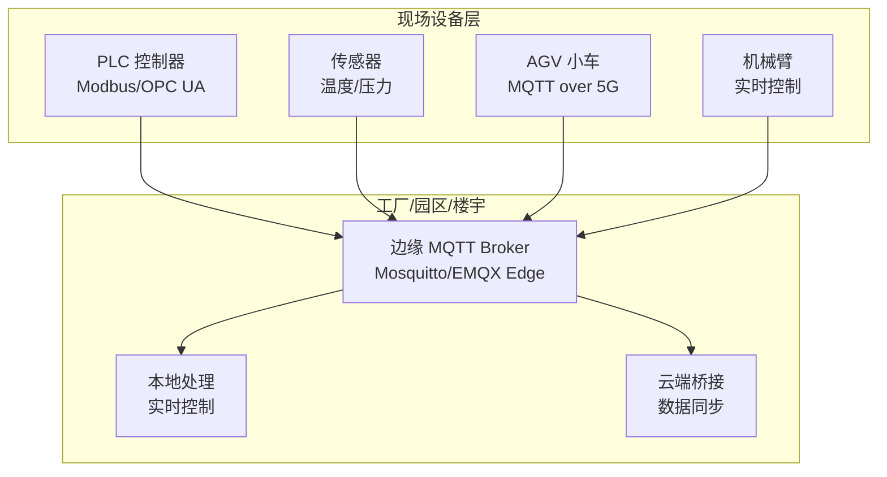
```mermaid
graph TB
    subgraph Edge["工厂/园区/楼宇"]
        EB["边缘 MQTT Broker<br/>Mosquitto/EMQX Edge"]
        Local["本地处理<br/>实时控制"]
        Bridge["云端桥接<br/>数据同步"]
        
        EB --> Local
        EB --> Bridge
    end
    
    subgraph Devices["现场设备层"]
        PLC["PLC 控制器<br/>Modbus/OPC UA"]
        Sensor["传感器<br/>温度/压力"]
        AGV["AGV 小车<br/>MQTT over 5G"]
        Arm["机械臂<br/>实时控制"]
    end
    
    PLC --> EB
    Sensor --> EB
    AGV --> EB
    Arm --> EB
```

**适用场景：** 工业控制、低延迟要求、数据主权敏感、弱网环境

**优势：**
- ✅ 超低延迟：本地处理 < 10ms
- ✅ 离线自治：断网时继续工作
- ✅ 数据安全：敏感数据不出厂
- ✅ 带宽节省：仅上传汇总数据

**硬件形态：**
- 工业网关（研华/研祥）
- 边缘服务器（戴尔 Edge 系列）
- ARM 盒子（树莓派集群）
- 5G MEC 节点

### 6.3 边云协同（混合部署）

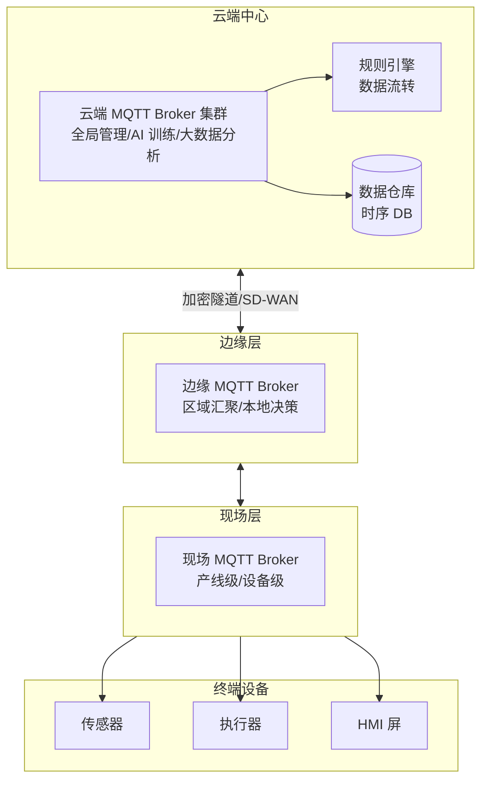
```mermaid
graph TB
    subgraph Cloud["云端中心"]
        CB["云端 MQTT Broker 集群<br/>全局管理/AI 训练/大数据分析"]
        Rule["规则引擎<br/>数据流转"]
        DW[("数据仓库<br/>时序 DB")]
        CB --> Rule
        CB --> DW
    end
    
    subgraph Edge["边缘层"]
        EB["边缘 MQTT Broker<br/>区域汇聚/本地决策"]
    end
    
    subgraph Field["现场层"]
        FB["现场 MQTT Broker<br/>产线级/设备级"]
    end
    
    subgraph Devices["终端设备"]
        D1["传感器"]
        D2["执行器"]
        D3["HMI 屏"]
    end
    
    Cloud <-->|加密隧道/SD-WAN| Edge
    Edge <--> Field
    Field --> D1
    Field --> D2
    Field --> D3
```

**数据流向：**

| 层级 | 延迟 | 用途 |
|------|------|------|
| 现场设备 → 现场 Broker | ms 级 | 实时控制 |
| 现场 Broker → 边缘 Broker | 10ms 级 | 区域协同 |
| 边缘 Broker → 云端 Broker | 100ms 级 | 全局优化 |
| 云端存储 | 秒级 | AI 训练/BI |

---

## 7. 底层传输协议揭秘

**核心答案：TCP/IP 为主，WebSocket 为辅**

### 7.1 协议栈分层

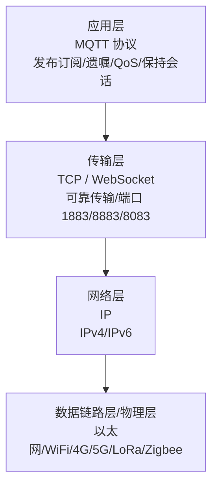
```mermaid
graph TB
    A[应用层<br/>MQTT 协议<br/>发布订阅/遗嘱/QoS/保持会话]
    B[传输层<br/>TCP / WebSocket<br/>可靠传输/端口 1883/8883/8083]
    C[网络层<br/>IP<br/>IPv4/IPv6]
    D[数据链路层/物理层<br/>以太网/WiFi/4G/5G/LoRa/Zigbee]
    
    A --> B --> C --> D
```

### 7.2 TCP（主要方式）

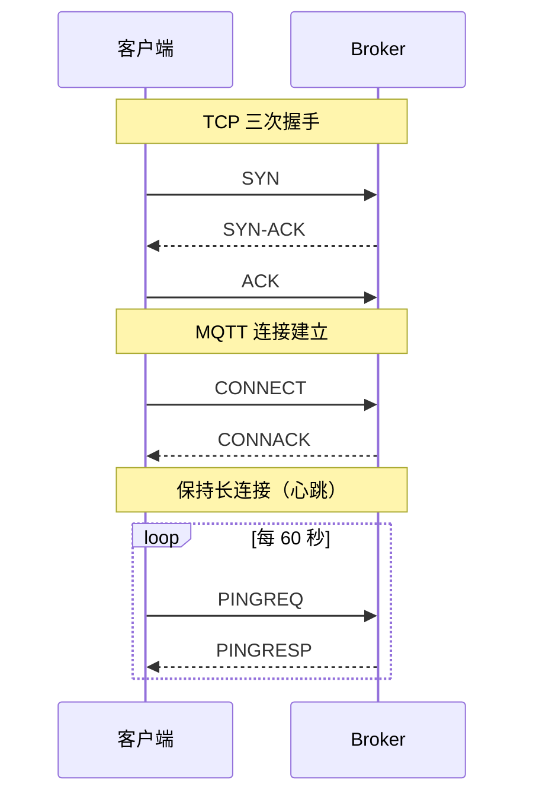
```mermaid
sequenceDiagram
    participant C as 客户端
    participant B as Broker
    
    Note over C,B: TCP 三次握手
    C->>B: SYN
    B-->>C: SYN-ACK
    C->>B: ACK
    
    Note over C,B: MQTT 连接建立
    C->>B: CONNECT
    B-->>C: CONNACK
    
    Note over C,B: 保持长连接（心跳）
    loop 每 60 秒
        C->>B: PINGREQ
        B-->>C: PINGRESP
    end
```

**默认端口：**

| 端口 | 协议 | 说明 |
|------|------|------|
| `1883` | MQTT over TCP | 明文传输 |
| `8883` | MQTT over TLS/SSL | 加密传输 |
| `8083` | MQTT over WebSocket | 浏览器连接 |
| `8084` | MQTT over WebSocket Secure | 加密 Web 连接 |

**为什么选择 TCP？**
- ✅ 可靠传输：内置重传机制，保证数据不丢
- ✅ 有序到达：消息按发送顺序到达
- ✅ 长连接支持：适合物联网设备持续在线
- ✅ 流量控制：防止网络拥塞

### 7.3 TLS/SSL（安全加密层）

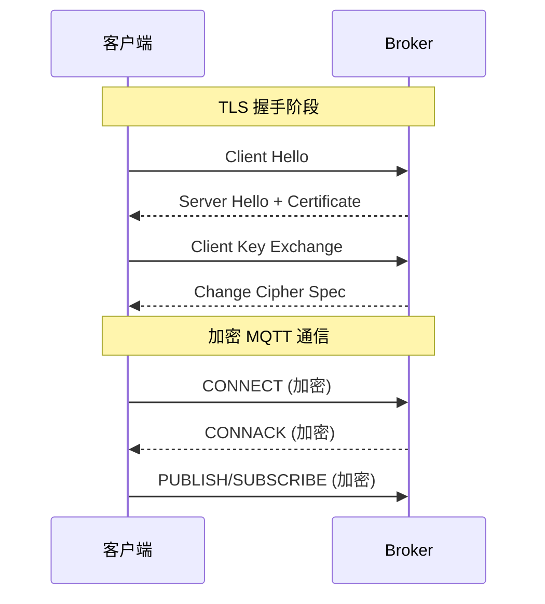
```mermaid
sequenceDiagram
    participant C as 客户端
    participant B as Broker
    
    Note over C,B: TLS 握手阶段
    C->>B: Client Hello
    B-->>C: Server Hello + Certificate
    C->>B: Client Key Exchange
    B-->>C: Change Cipher Spec
    
    Note over C,B: 加密 MQTT 通信
    C->>B: CONNECT (加密)
    B-->>C: CONNACK (加密)
    C->>B: PUBLISH/SUBSCRIBE (加密)
```

**加密内容：**
- ✅ 设备证书（X.509）双向认证
- ✅ 用户名/密码加密传输
- ✅ 所有 MQTT 报文 AES 加密
- ✅ 防止中间人攻击/窃听

### 7.4 WebSocket（浏览器支持）

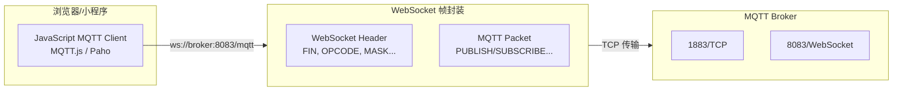
```mermaid
graph LR
    subgraph Browser["浏览器/小程序"]
        JS["JavaScript MQTT Client<br/>MQTT.js / Paho"]
    end
    
    subgraph WS["WebSocket 帧封装"]
        Header["WebSocket Header<br/>FIN, OPCODE, MASK..."]
        Payload["MQTT Packet<br/>PUBLISH/SUBSCRIBE..."]
    end
    
    subgraph Broker["MQTT Broker"]
        TCP1883["1883/TCP"]
        WS8083["8083/WebSocket"]
    end
    
    JS -->|ws://broker:8083/mqtt| WS
    WS -->|TCP 传输 | Broker
```

**WebSocket 优势：**
- ✅ 浏览器原生支持，无需插件
- ✅ 穿透防火墙（使用 80/443 端口）
- ✅ 与 HTTP 共享服务器端口

### 7.5 其他底层协议

| 协议 | 端口 | 适用场景 | 特点 |
|------|------|----------|------|
| **TCP** | 1883 | 标准物联网设备 | 最常用，成熟稳定 |
| **TLS** | 8883 | 安全敏感场景 | 金融/医疗/政府 |
| **WebSocket** | 8083 | Web 应用/小程序 | 浏览器直接连接 |
| **WSS** | 8084 | 安全 Web 应用 | WebSocket over TLS |
| **QUIC** | 8884 | 低延迟移动场景 | 基于 UDP，抗弱网 |
| **MQTT-SN** | 1884 | 极受限传感器 | 无 TCP 开销，更轻量 |

---

## 8. Python 实战代码

### 8.1 基础连接与发布

安装依赖：`pip install paho-mqtt`

```python
import paho.mqtt.client as mqtt
import json
import time

# MQTT 配置
BROKER = "broker.emqx.io"
PORT = 1883
CLIENT_ID = "python-client-001"
USERNAME = "your_username"
PASSWORD = "your_password"

# 回调函数：连接成功
def on_connect(client, userdata, flags, rc):
    if rc == 0:
        print(f"✅ 已连接到 Broker: {BROKER}")
        # 订阅主题
        client.subscribe("sensors/temperature", qos=1)
    else:
        print(f"❌ 连接失败，返回码：{rc}")

# 回调函数：收到消息
def on_message(client, userdata, msg):
    print(f"📩 收到消息 - 主题：{msg.topic}")
    print(f"   QoS: {msg.qos}, 内容：{msg.payload.decode()}")

# 回调函数：订阅确认
def on_subscribe(client, userdata, mid, granted_qos):
    print(f"✅ 订阅成功，QoS: {granted_qos}")

# 创建客户端
client = mqtt.Client(client_id=CLIENT_ID)
client.username_pw_set(USERNAME, PASSWORD)

# 设置回调
client.on_connect = on_connect
client.on_message = on_message
client.on_subscribe = on_subscribe

# 连接 Broker
client.connect(BROKER, PORT, keepalive=60)

# 发布消息
for i in range(5):
    payload = json.dumps({
        "temperature": 25.5 + i * 0.1,
        "humidity": 60,
        "timestamp": time.time()
    })
    result = client.publish("sensors/temperature", payload, qos=1)
    status, mid = result.wait_for_publish()
    print(f"📤 已发布消息 #{i+1}, mid={mid}, status={status}")
    time.sleep(1)

# 启动网络循环（非阻塞）
client.loop_start()

# 保持运行
try:
    while True:
        time.sleep(1)
except KeyboardInterrupt:
    print("\n👋 正在断开连接...")
    client.loop_stop()
    client.disconnect()
```

### 8.2 使用 TLS 加密连接

```python
import paho.mqtt.client as mqtt
import ssl

# TLS 配置
BROKER = "broker.example.com"
PORT = 8883  # TLS 端口
CA_CERTS = "ca.crt"
CLIENT_CERT = "client.crt"
CLIENT_KEY = "client.key"

def on_connect(client, userdata, flags, rc):
    if rc == 0:
        print("✅ 安全连接已建立")
    else:
        print(f"❌ 连接失败：{rc}")

client = mqtt.Client(client_id="secure-client")

# 配置 TLS
client.tls_set(
    ca_certs=CA_CERTS,
    certfile=CLIENT_CERT,
    keyfile=CLIENT_KEY,
    tls_version=ssl.PROTOCOL_TLSv1_2
)

client.on_connect = on_connect
client.connect(BROKER, PORT, keepalive=60)
client.loop_forever()
```

### 8.3 遗嘱消息（Last Will）

```python
import paho.mqtt.client as mqtt
import json

BROKER = "broker.emqx.io"
PORT = 1883

# 配置遗嘱消息
will_payload = json.dumps({
    "status": "offline",
    "reason": "unexpected_disconnect"
})

client = mqtt.Client(client_id="device-001")

# 设置遗嘱
client.will_set(
    topic="devices/device-001/status",
    payload=will_payload,
    qos=1,
    retain=True  # 保留消息
)

def on_connect(client, userdata, flags, rc):
    if rc == 0:
        print("✅ 连接成功，遗嘱消息已设置")
        # 发布在线状态
        client.publish(
            "devices/device-001/status",
            json.dumps({"status": "online"}),
            qos=1,
            retain=True
        )

client.on_connect = on_connect
client.connect(BROKER, PORT)
client.loop_forever()
```

### 8.4 完整的生产者 - 消费者示例

```python
"""
MQTT 生产者 - 消费者完整示例
模拟 IoT 设备数据上报与处理
"""
import paho.mqtt.client as mqtt
import json
import random
import time
from datetime import datetime
from typing import Optional

class MQTTDataPublisher:
    """MQTT 数据发布者"""
    
    def __init__(self, broker: str, port: int, client_id: str):
        self.broker = broker
        self.port = port
        self.client_id = client_id
        self.client: Optional[mqtt.Client] = None
        self.connected = False
        
    def connect(self):
        """连接到 MQTT Broker"""
        self.client = mqtt.Client(client_id=self.client_id)
        self.client.on_connect = self._on_connect
        self.client.on_disconnect = self._on_disconnect
        self.client.connect(self.broker, self.port, keepalive=60)
        self.client.loop_start()
        
    def _on_connect(self, client, userdata, flags, rc):
        if rc == 0:
            self.connected = True
            print(f"✅ {self.client_id} 已连接")
        else:
            print(f"❌ 连接失败：{rc}")
            
    def _on_disconnect(self, client, userdata, rc):
        self.connected = False
        print(f"🔌 {self.client_id} 已断开")
        
    def publish_sensor_data(self, device_id: str, temp: float, humidity: float):
        """发布传感器数据"""
        if not self.connected:
            return False
            
        payload = {
            "device_id": device_id,
            "temperature": temp,
            "humidity": humidity,
            "timestamp": datetime.now().isoformat()
        }
        
        topic = f"sensors/{device_id}/telemetry"
        result = self.client.publish(topic, json.dumps(payload), qos=1)
        return result.is_published()
        
    def disconnect(self):
        """断开连接"""
        if self.client:
            self.client.loop_stop()
            self.client.disconnect()


class MQTTDataConsumer:
    """MQTT 数据消费者"""
    
    def __init__(self, broker: str, port: int, client_id: str):
        self.broker = broker
        self.port = port
        self.client_id = client_id
        self.client: Optional[mqtt.Client] = None
        
    def connect(self, topics: list):
        """连接并订阅主题"""
        self.client = mqtt.Client(client_id=self.client_id)
        self.client.on_connect = self._on_connect
        self.client.on_message = self._on_message
        
        self.client.connect(self.broker, self.port, keepalive=60)
        
        # 订阅主题
        for topic in topics:
            self.client.subscribe(topic, qos=1)
            print(f"📬 订阅主题：{topic}")
            
        self.client.loop_forever()
        
    def _on_connect(self, client, userdata, flags, rc):
        if rc == 0:
            print(f"✅ 消费者 {self.client_id} 已连接")
        else:
            print(f"❌ 连接失败：{rc}")
            
    def _on_message(self, client, userdata, msg):
        """处理收到的消息"""
        try:
            data = json.loads(msg.payload.decode())
            print(f"\n📩 收到数据:")
            print(f"   主题：{msg.topic}")
            print(f"   设备：{data.get('device_id')}")
            print(f"   温度：{data.get('temperature')}°C")
            print(f"   湿度：{data.get('humidity')}%")
            print(f"   时间：{data.get('timestamp')}")
            
            # 这里可以添加数据处理逻辑
            self._process_data(data)
            
        except json.JSONDecodeError:
            print(f"❌ 无法解析消息：{msg.payload}")
            
    def _process_data(self, data: dict):
        """处理传感器数据"""
        temp = data.get('temperature', 0)
        if temp > 30:
            print(f"   ⚠️  高温告警：{temp}°C")
        elif temp < 10:
            print(f"   ⚠️  低温告警：{temp}°C")


# 使用示例
if __name__ == "__main__":
    BROKER = "broker.emqx.io"
    PORT = 1883
    
    # 创建发布者
    publisher = MQTTDataPublisher(BROKER, PORT, "publisher-001")
    publisher.connect()
    
    # 模拟发布数据
    try:
        for i in range(10):
            publisher.publish_sensor_data(
                device_id=f"sensor-{i % 3 + 1}",
                temp=random.uniform(20, 35),
                humidity=random.uniform(40, 80)
            )
            time.sleep(2)
    except KeyboardInterrupt:
        print("\n👋 停止发布")
    finally:
        publisher.disconnect()
```

---

## 9. Go 实战代码

### 9.1 基础连接与发布

安装依赖：`go get github.com/eclipse/paho.mqtt.golang`

```go
package main

import (
	"encoding/json"
	"fmt"
	"log"
	"time"

	mqtt "github.com/eclipse/paho.mqtt.golang"
)

// MQTT 配置
const (
	Broker   = "tcp://broker.emqx.io:1883"
	ClientID = "go-client-001"
	Username = "your_username"
	Password = "your_password"
)

// 传感器数据结构
type SensorData struct {
	Temperature float64 `json:"temperature"`
	Humidity    float64 `json:"humidity"`
	Timestamp   int64   `json:"timestamp"`
}

func main() {
	// 创建客户端选项
	opts := mqtt.NewClientOptions()
	opts.AddBroker(Broker)
	opts.SetClientID(ClientID)
	opts.SetUsername(Username)
	opts.SetPassword(Password)
	opts.SetKeepAlive(60 * time.Second)
	opts.SetPingTimeout(10 * time.Second)

	// 连接丢失回调
	opts.SetConnectionLostHandler(func(client mqtt.Client, err error) {
		log.Printf("❌ 连接丢失：%v", err)
	})

	// 重连回调
	opts.SetOnConnectHandler(func(client mqtt.Client) {
		log.Println("✅ 已连接到 Broker")
		// 订阅主题
		token := client.Subscribe("sensors/temperature", 1, messageHandler)
		token.Wait()
		if token.Error() != nil {
			log.Printf("❌ 订阅失败：%v", token.Error())
		} else {
			log.Println("✅ 订阅成功")
		}
	})

	// 创建并连接客户端
	client := mqtt.NewClient(opts)
	token := client.Connect()
	token.Wait()
	if token.Error() != nil {
		log.Fatalf("❌ 连接失败：%v", token.Error())
	}

	// 发布消息
	for i := 0; i < 5; i++ {
		data := SensorData{
			Temperature: 25.5 + float64(i)*0.1,
			Humidity:    60.0,
			Timestamp:   time.Now().Unix(),
		}

		payload, _ := json.Marshal(data)
		token := client.Publish("sensors/temperature", 1, false, payload)
		token.Wait()

		if token.Error() != nil {
			log.Printf("❌ 发布失败：%v", token.Error())
		} else {
			log.Printf("📤 已发布消息 #%d: %s", i+1, string(payload))
		}

		time.Sleep(1 * time.Second)
	}

	// 保持运行
	time.Sleep(5 * time.Second)

	// 断开连接
	client.Disconnect(250)
	log.Println("👋 已断开连接")
}

// 消息处理回调
func messageHandler(client mqtt.Client, msg mqtt.Message) {
	log.Printf("📩 收到消息 - 主题：%s", msg.Topic())
	log.Printf("   QoS: %d, 内容：%s", msg.Qos(), string(msg.Payload()))
}
```

### 9.2 使用 TLS 加密连接

```go
package main

import (
	"crypto/tls"
	"crypto/x509"
	"log"
	"os"
	"time"

	mqtt "github.com/eclipse/paho.mqtt.golang"
)

func createTLSConfig(caCertPath, clientCertPath, clientKeyPath string) (*tls.Config, error) {
	// 加载 CA 证书
	caCert, err := os.ReadFile(caCertPath)
	if err != nil {
		return nil, err
	}
	caCertPool := x509.NewCertPool()
	caCertPool.AppendCertsFromPEM(caCert)

	// 加载客户端证书
	cert, err := tls.LoadX509KeyPair(clientCertPath, clientKeyPath)
	if err != nil {
		return nil, err
	}

	// 创建 TLS 配置
	tlsConfig := &tls.Config{
		Certificates: []tls.Certificate{cert},
		RootCAs:      caCertPool,
		MinVersion:   tls.VersionTLS12,
	}

	return tlsConfig, nil
}

func main() {
	opts := mqtt.NewClientOptions()
	opts.AddBroker("ssl://broker.example.com:8883")
	opts.SetClientID("secure-go-client")

	// 配置 TLS
	tlsConfig, err := createTLSConfig("ca.crt", "client.crt", "client.key")
	if err != nil {
		log.Fatalf("❌ TLS 配置失败：%v", err)
	}
	opts.SetTLSConfig(tlsConfig)

	opts.SetOnConnectHandler(func(client mqtt.Client) {
		log.Println("✅ 安全连接已建立")
	})

	client := mqtt.NewClient(opts)
	token := client.Connect()
	token.Wait()
	if token.Error() != nil {
		log.Fatalf("❌ 连接失败：%v", token.Error())
	}

	// 保持连接
	select {}
}
```

### 9.3 完整的生产者 - 消费者示例

```go
package main

import (
	"context"
	"encoding/json"
	"fmt"
	"log"
	"math/rand"
	"os"
	"os/signal"
	"syscall"
	"time"

	mqtt "github.com/eclipse/paho.mqtt.golang"
)

// 传感器数据
type SensorData struct {
	DeviceID    string  `json:"device_id"`
	Temperature float64 `json:"temperature"`
	Humidity    float64 `json:"humidity"`
	Timestamp   string  `json:"timestamp"`
}

// MQTTPublisher MQTT 发布者
type MQTTPublisher struct {
	client    mqtt.Client
	broker    string
	clientID  string
	connected bool
}

func NewMQTTPublisher(broker, clientID string) *MQTTPublisher {
	return &MQTTPublisher{
		broker:   broker,
		clientID: clientID,
	}
}

func (p *MQTTPublisher) Connect() error {
	opts := mqtt.NewClientOptions()
	opts.AddBroker(p.broker)
	opts.SetClientID(p.clientID)
	opts.SetKeepAlive(60 * time.Second)

	opts.SetOnConnectHandler(func(client mqtt.Client) {
		log.Printf("✅ %s 已连接", p.clientID)
		p.connected = true
	})

	opts.SetConnectionLostHandler(func(client mqtt.Client, err error) {
		log.Printf("❌ 连接丢失：%v", err)
		p.connected = false
	})

	p.client = mqtt.NewClient(opts)
	token := p.client.Connect()
	token.Wait()
	return token.Error()
}

func (p *MQTTPublisher) PublishSensorData(deviceID string, temp, humidity float64) error {
	if !p.connected {
		return fmt.Errorf("未连接")
	}

	data := SensorData{
		DeviceID:    deviceID,
		Temperature: temp,
		Humidity:    humidity,
		Timestamp:   time.Now().Format(time.RFC3339),
	}

	payload, err := json.Marshal(data)
	if err != nil {
		return err
	}

	topic := fmt.Sprintf("sensors/%s/telemetry", deviceID)
	token := p.client.Publish(topic, 1, false, payload)
	token.Wait()
	return token.Error()
}

func (p *MQTTPublisher) Disconnect() {
	if p.client != nil {
		p.client.Disconnect(250)
	}
}

// MQTTConsumer MQTT 消费者
type MQTTConsumer struct {
	client   mqtt.Client
	broker   string
	clientID string
}

func NewMQTTConsumer(broker, clientID string) *MQTTConsumer {
	return &MQTTConsumer{
		broker:   broker,
		clientID: clientID,
	}
}

func (c *MQTTConsumer) Connect(topics []string) error {
	opts := mqtt.NewClientOptions()
	opts.AddBroker(c.broker)
	opts.SetClientID(c.clientID)
	opts.SetKeepAlive(60 * time.Second)

	opts.SetOnConnectHandler(func(client mqtt.Client) {
		log.Printf("✅ 消费者 %s 已连接", c.clientID)
		// 订阅主题
		for _, topic := range topics {
			token := client.Subscribe(topic, 1, c.messageHandler)
			token.Wait()
			if token.Error() != nil {
				log.Printf("❌ 订阅失败 %s: %v", topic, token.Error())
			} else {
				log.Printf("📬 订阅主题：%s", topic)
			}
		}
	})

	c.client = mqtt.NewClient(opts)
	token := c.client.Connect()
	token.Wait()
	return token.Error()
}

func (c *MQTTConsumer) messageHandler(client mqtt.Client, msg mqtt.Message) {
	var data SensorData
	if err := json.Unmarshal(msg.Payload(), &data); err != nil {
		log.Printf("❌ 解析失败：%v", err)
		return
	}

	log.Printf("\n📩 收到数据:")
	log.Printf("   主题：%s", msg.Topic())
	log.Printf("   设备：%s", data.DeviceID)
	log.Printf("   温度：%.1f°C", data.Temperature)
	log.Printf("   湿度：%.1f%%", data.Humidity)
	log.Printf("   时间：%s", data.Timestamp)

	// 处理告警
	c.processAlerts(data)
}

func (c *MQTTConsumer) processAlerts(data SensorData) {
	if data.Temperature > 30 {
		log.Printf("   ⚠️  高温告警：%.1f°C", data.Temperature)
	} else if data.Temperature < 10 {
		log.Printf("   ⚠️  低温告警：%.1f°C", data.Temperature)
	}
}

func main() {
	const broker = "tcp://broker.emqx.io:1883"

	// 创建发布者
	publisher := NewMQTTPublisher(broker, "go-publisher-001")
	if err := publisher.Connect(); err != nil {
		log.Fatalf("❌ 发布者连接失败：%v", err)
	}
	defer publisher.Disconnect()

	// 设置信号处理
	ctx, stop := signal.NotifyContext(context.Background(), os.Interrupt, syscall.SIGTERM)
	defer stop()

	// 发布数据
	ticker := time.NewTicker(2 * time.Second)
	defer ticker.Stop()

	deviceIDs := []string{"sensor-1", "sensor-2", "sensor-3"}
	count := 0

	for {
		select {
		case <-ctx.Done():
			log.Println("\n👋 正在退出...")
			return
		case <-ticker.C:
			deviceID := deviceIDs[count%len(deviceIDs)]
			temp := 20 + rand.Float64()*15
			humidity := 40 + rand.Float64()*40

			if err := publisher.PublishSensorData(deviceID, temp, humidity); err != nil {
				log.Printf("❌ 发布失败：%v", err)
			} else {
				log.Printf("📤 已发布：设备=%s, 温度=%.1f°C", deviceID, temp)
			}
			count++
		}
	}
}
```

---

## 10. 常见应用场景

### 10.1 物联网（IoT）设备监控

```mermaid
graph LR
    subgraph 设备层
        S1[温度传感器]
        S2[湿度传感器]
        S3[压力传感器]
        S4[GPS 定位器]
    end
    
    subgraph Broker 层
        B[MQTT Broker]
    end
    
    subgraph 应用层
        D1[数据存储]
        D2[数据分析]
        D3[告警系统]
    end
    
    S1 --> B
    S2 --> B
    S3 --> B
    S4 --> B
    B --> D1
    B --> D2
    B --> D3
```

**典型主题设计：**
```
devices/{device_id}/telemetry      # 遥测数据
devices/{device_id}/status         # 设备状态
devices/{device_id}/commands       # 控制命令
devices/{device_id}/commands/resp  # 命令响应
```

### 10.2 实时消息推送

| 场景 | 主题设计 | 说明 |
|------|----------|------|
| 即时聊天 | `users/{user_id}/messages` | 用户上线即订阅个人主题 |
| 系统通知 | `notifications/{user_id}` | 推送系统公告、订单状态 |
| 实时数据 | `stocks/{symbol}/price` | 股票行情、体育比分 |

### 10.3 智能家居系统

```mermaid
graph TB
    Hub["🏠 智能家居中枢<br/>MQTT Broker"]
    
    Light["💡 智能灯泡<br/>home/lights/living-room"]
    Thermostat["🌡️ 温控器<br/>home/thermostat"]
    Lock["🔒 智能门锁<br/>home/locks/front-door"]
    Camera["📷 摄像头<br/>home/cameras/{id}/status"]
    Sensor["🔔 传感器<br/>home/sensors/{type}"]
    App["📱 手机 App<br/>home/app/commands"]
    
    Hub --- Light
    Hub --- Thermostat
    Hub --- Lock
    Hub --- Camera
    Hub --- Sensor
    Hub --- App
```

**智能家居主题设计示例：**

| 设备 | 控制主题 | 状态主题 |
|------|----------|----------|
| 灯泡 | `home/lights/+/set` | `home/lights/+/state` |
| 窗帘 | `home/blinds/+/set` | `home/blinds/+/position` |
| 空调 | `home/ac/+/command` | `home/ac/+/status` |

### 10.4 日志收集与监控

```
# 服务状态（使用 Retain 标志）
services/{service_id}/health      # {"status": "healthy", "uptime": 3600}
services/{service_id}/metrics     # {"cpu": 45%, "mem": 2.1GB}

# 日志收集
logs/{service_id}/{level}         # level: debug, info, warn, error
logs/{service_id}/errors          # 仅错误日志

# 告警
alerts/{severity}/{service_id}    # severity: critical, warning, info
```

### 10.5 车联网（V2X）

| 场景 | 主题设计 | 说明 |
|------|----------|------|
| 车辆遥测 | `vehicles/{vin}/location` | 实时上报位置、速度 |
| 远程诊断 | `vehicles/{vin}/diagnostics` | 故障码上报 |
| OTA 升级 | `vehicles/{vin}/ota/status` | 固件升级进度 |

### 10.6 工业物联网（IIoT）

**工业场景特点：**
- ✅ **高可靠性：** 使用 QoS 1 或 QoS 2 确保消息送达
- ✅ **低延迟：** 本地部署 Broker，减少网络延迟
- ✅ **安全性：** TLS 加密 + 客户端证书认证
- ✅ **大规模：** 支持数万设备并发连接

**工业主题命名规范（参考 Sparkplug B）：**
```
spBv1.0/{Group ID}/DDATA/{Device ID}    # 设备数据
spBv1.0/{Group ID}/NCMD/{Device ID}     # 节点命令
spBv1.0/{Group ID}/DCMD/{Device ID}     # 设备命令
spBv1.0/{Group ID}/STATE                # 边缘节点状态
```

---

## 总结

MQTT 作为物联网领域的**事实标准协议**，具有以下核心优势：

1. **轻量级设计**：最小 2 字节包头，适合资源受限设备
2. **灵活的 QoS**：三种级别满足不同可靠性需求
3. **发布/订阅模式**：解耦消息生产者和消费者
4. **长连接支持**：实时推送，低延迟通信
5. **遗嘱消息**：自动检测设备离线
6. **主题路由**：灵活的消息分发机制
7. **安全性**：支持 TLS 加密和多种认证方式

无论是嵌入式传感器、工业网关，还是云端 IoT 平台，MQTT 都能提供可靠、高效的消息传输服务。

---

**参考资料：**
- MQTT 3.1.1 规范：https://docs.oasis-open.org/mqtt/mqtt/v3.1.1/mqtt-v3.1.1.html
- MQTT 5.0 规范：https://docs.oasis-open.org/mqtt/mqtt/v5.0/mqtt-v5.0.html
- Eclipse Mosquitto：https://mosquitto.org/
- EMQX：https://www.emqx.com/

---

*本文配套静态网站教程，包含更多交互式图表和代码示例。*
